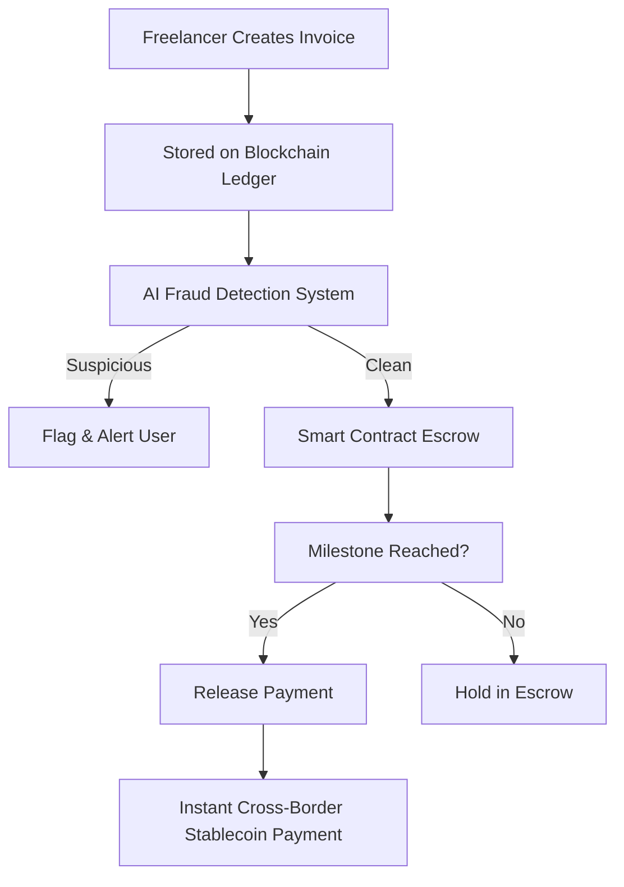
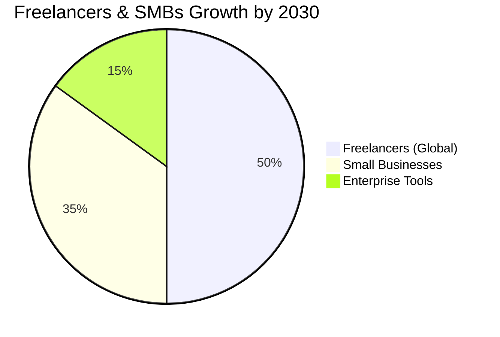

# 🌐 Finote – AI & Blockchain Powered Invoicing & Payments

> Secure • Transparent • Instant  
Empowering freelancers and small businesses with trustless, tamper-proof invoicing and instant global payments.

---

## 🚨 The Problem

Freelancers and small businesses face challenges in **getting paid on time and securely**:

- ⏳ **Delayed Payments**: Long settlement cycles and client excuses.  
- 📝 **Invoice Tampering**: Easy manipulation of digital invoices.  
- 🕵️ **Fraud & Scams**: Fake clients, forged invoices, double payments.  
- 🌍 **Cross-Border Issues**: High fees, slow transfers, and compliance hurdles.  
- ❌ **Fragmented Tools**: Current tools don’t combine invoicing, fraud detection, and payments.  

---

## 💡 Our Solution – Finote

**Finote** is an **AI + Blockchain invoicing platform** that ensures **security, transparency, and instant payments**.

### Key Components
- 🤖 **AI Fraud Detection** → Real-time anomaly & fraud alerts.  
- 🔗 **Blockchain Ledger** → Immutable & auditable invoices.  
- 🤝 **Smart Contract Escrow** → Automated milestone-based payments.  
- 🪪 **Decentralized Identity (DID)** → Builds trust between parties.  
- 💱 **Cross-Border Stablecoin Payments** → Fast, low-fee global transfers.  
- 📊 **Automated Compliance** → Tax-ready & regulation-friendly.  

---

## 📊 How Finote Works

 --------------------------------------------------
|  Finote Dashboard                                |
|--------------------------------------------------|
| Invoices | Payments | Clients | Fraud Alerts     |
|--------------------------------------------------|
| ✔ Invoice #12345   Status: In Escrow             |
| ✔ Invoice #12346   Status: Paid                  |
| ⚠ Invoice #12347   Fraud Alert: Suspicious Edit  |
|--------------------------------------------------|
| Balance: $2,450 USDT   |   Escrow Held: $900     |
 --------------------------------------------------

---

---

## 🙌 Acknowledgements

Special thanks to the open-source community, blockchain developers, and AI researchers whose tools and insights make **Finote** possible.  

---

## 📬 Contact

- 🌐 Website: [finote.io](https://finote.io) *(placeholder)*  
- 📧 Email: hello@finote.io  
- 🐦 Twitter/X: [@FinoteApp](https://twitter.com) *(placeholder)*  
- 💼 LinkedIn: [Finote](https://linkedin.com) *(placeholder)*  

---

## ⭐ Support Us

If you find **Finote** useful, please consider:

- Giving us a ⭐ on [GitHub](https://github.com)  
- Sharing with your network to help freelancers & small businesses thrive 🌍  

---

## 📜 License

MIT License © 2025 Finote  

---

  Made with ❤️ by the <b>Finote</b> team

